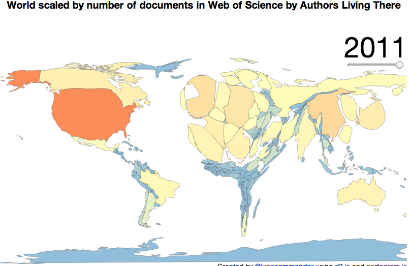
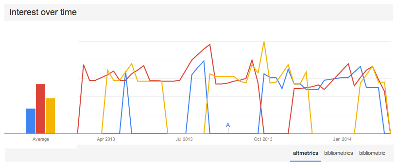
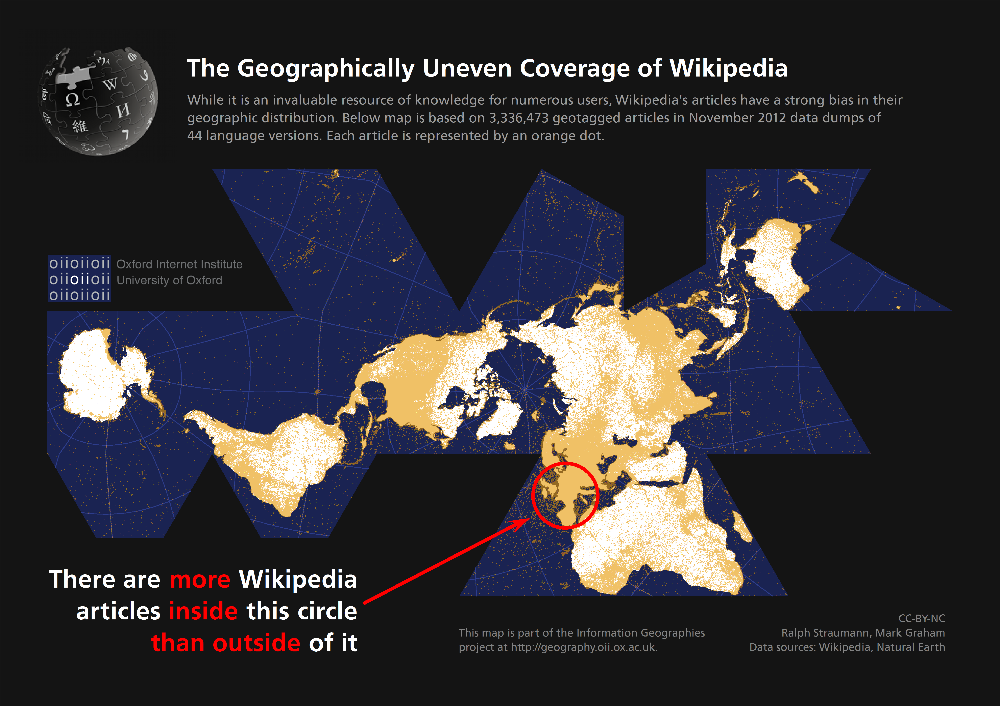

# Altmetrics for developing regions: The prologue, the proposal, the promise, the problem, and the prognosis 

## The prologue
A significant group of scholars from around the world love to hate the Journal Impact Factor (JIF).[1](#foot1) An incredible amount of ink has been spilled on describing its methodological limitations, its abuse and misuse, and its pervasive effects on "science." But, while the loathing of the JIF (I hazard to guess) is distributed fairly equally around the world, the scholars who are affected by its use are not. It is scholars from developing regions who suffer the most egregious consequences.

The problems for developing regions stem from the under-representation of developing world research in Thomson Reuters' Web of Science (WoS), from which the JIF is calculated. In a seminal piece from fifteen years ago, Cetto & Alonso-Gamboa ([1998](http://www.interciencia.org/v23_02/cetto.pdf)) laid out the disheartening situation of Latin American journals in international information systems such as the WoS. As can be seen from the figure below, which shows the relative number of works authored by scholars from around the world in WoS, this situation has not significantly changed over time. 

The shortage of research from developing regions is not for a lack of research. In Latin America, to draw on the region I am most familiar with, in 2012, only 4% of Latin American peer reviewed journals were included in WoS (242 out of [over 5,000](http://www.latindex.org/index.html?opcion=2)) (see them in the [Latindex Catalog](http://www.latindex.org/)). Two give another example, two initiatives, [SciELO](http://www.scielo.org) and [RedALyC](http://www.redalyc.org), working with only a subset of these 5000+ journals, have indexed over half a million articles in regional journals, primarily from Latin American authors.[2](#foot2) There is an abundance of locally produced and published research in developing regions, just not in WoS.

The argument for this bias has always been that research from the developing world does not form part of "mainstream" or "international" science. Although I take exception to this argument, regardless of its rationale, the end result is the same: the WoS is an inadequate dataset to understand the impact of scholarly communications from developing regions, or to otherwise study it. To serve scholars from developing regions, it is imperative to find an alternative.

	 
	See here, for an <a href="http://jalperin.github.io/d3-cartogram/">interactive map going back to 1990</a>.

## The proposal 

The scholarly community is abuzz with _[altmetrics](http://en.wikipedia.org/wiki/Altmetrics)_ and the related (but different) term _Article Level Metrics_.[3](#foot3) These metrics, derived primarily from "the social Web," have been purposely constructed to be alternatives to the JIF. Since the drafting of the [altmetrics manifesto](http://altmetrics.org/manifesto/), there has been a [special issue](http://asis.org/Bulletin/Apr-13/), a [PLOS collection](http://www.ploscollections.org/altmetrics), a [Mendeley group](http://www.mendeley.com/groups/586171/altmetrics/), several [annual](http://lanyrd.com/2013/alm13/) [workshops](http://altmetrics.org/altmetrics14/), an increasing number of research papers, and several altmetric start-ups. During a few months in the last 12, the term _altmetrics_ has even been more popular than _bibliometrics_ and _bibliometric_ (although the term _Journal Impact Factor_ still dwarfs both). 

All of these signs indicate that altmetrics may not remain _alternative_ for long. Whether they supplant or complement the JIF, they bring with them a promise, but no guarantees, for developing regions. 

	 
	Or see what this looks like <a href="http://www.google.com/trends/explore?hl=en-US&q=altmetrics,+bibliometrics,+bibliometric&date=today+12-m&cmpt=q&content=1">today</a>

## The promise

Altmetrics are captured from the Web (i.e., social media, blogs, wikipedia), and thus are (somewhat) more democratic—one reader, one vote.[4](#foot4) Unlike citations, which can only be counted if the citing document is in a select group of journals, altmetrics are counted regardless of where in the world they are originated, with one important consequences: they open the possibility of tracking impact in new segments, both within and beyond the academy. 

The corollary to this consequence is that altmetrics enable scholars to be incentivized and rewarded for impact in these new audiences. The JIF only captured impact from one audience, those publishing in WoS journals; altmetrics, on the other hand, can capture "diverse audiences including scholars but also practitioners, clinicians, educators and the general public" ([Piwowar, 2013](http://www.asis.org/Bulletin/Apr-13/AprMay13_Piwowar.html)) And, given that developing world scholars were systematically under-represented in the WoS, new audiences could mean into developing world audiences, interested in local and regional academic or public interests. Of all the potential benefits of altmetrics, this is the true promise for the developing world: an opportunity to redirect incentive structures towards problems that contribute to _development_, or at least to local priorities, be it through academic, policy, personal, or professional-practice impact. 

## The problem

This promise, however, is not by any means guaranteed. To realize the promise, the altmetrics community needs to actively engage with scholars from developing regions. As the field advances, it will become essential to further understand the _ways_ in which altmetrics are different from citations, and how these new metrics might shape research agendas. So far, much of the research has found that these new metrics capture a different “dimension”, “flavour”, or “type” of impact than citations ([Torres-Salinas et al., 2013](http://dx.doi.org/10.3916/C41-2013-05); [Costas et al., 2014](http://arxiv.org/abs/1401.4321); [Haustein & Peters, 2013](10.1002/asi.23101); [Eysenbach, 2011](10.2196/jmir.2012)), but it has not theorized or explored what else they might mean. There is reason to be optimistic—most altmetric research ends with a call for further study of the reliability, validity, and context of the available metrics, but there is also a risk that without this understanding, altmetrics will only be used as a proxy for traditional citation impact. 

There is also a risk of altmetrics becoming yet another method for ranking scholars. If this happens, then it will once again turn attention of developing world scholars to the audiences in the United States and Europe—for this is where social media has most deeply penetrated. At the [ALM workshop](http://lanyrd.com/2013/alm13/) in October 2013, I presented a [series of maps](https://speakerdeck.com/jalperin/altmetrics-propagating-global-inequality) showing the varying levels of penetration of Internet, Twitter, Facebook, and Mendeley (all common altmetric sources). A new map from the Oxford Internet Institute now shows us the [uneven geography of Wikipedia](http://geography.oii.ox.ac.uk/#the-geographically-uneven-coverage-of-wikipedia). If the name of the game becomes increasing altmetric scores, it will still be a better strategy to cater research to places where the sources of altmetrics are more heavily used (read: not in the developing world).

	 
	Read more <a href="http://geography.oii.ox.ac.uk/#the-geographically-uneven-coverage-of-wikipedia">here</a>

## The prognosis

The current focus on assessment (and to a lesser degree filtering and discovery) will give authors a new tool for demonstrating impact beyond citations, and it may help connect researchers with research. It is an important and necessary first step for the reasons I note above. If the first years of altmetrics/ALMs saw the shift from "[_WHAT_ (are ALMs and should we care) to  _HOW_](http://blogs.plos.org/tech/alms/)", then beneficial directions for developing regions would be to ask _WHO_ (is behind the metrics) or to again ask _WHAT_, but this time, _WHAT_ (do we need metrics _of_). The WHAT should be to expand the offerings of altmetrics to the non-traditional research products of scholars from the developing world, like those proposed by Piwowar ([2013](http://www.nature.com/nature/journal/v493/n7431/full/493159a.html)), but also arbitrary URLs of reports, policy briefs, program evaluations, and to the many journal articles published without [DOIs](http://www.plosbiology.org/article/info:doi/10.1371/journal.pbio.0000057). The WHO would necesitate building tools that help scholars _identify_ and _connect_ with their audiences, which should create a feedback loop that encourages authors to direct their research to areas of relevance to their primary audience, be it academic or public. 

It is early days and these are only early ideas. Further research on altmetrics, especially in contexts beyond well-known and well-established journals (i.e., Science and Nature), and outside of the in so-called global North (i.e., the United States or Western Europe) is desperately needed. However, this alone is not enough. In order to remain **pro**-altmetrics, the field and the tools of altmetrics must be crafted with the participation of a diverse group scholars, so that their development can be inclusive of multiple perspectives and needs. 

In this direction, the [Public Knowledge Project](http://pkp.sfu.ca) (where I am a researcher) is now working with [PLOS' ALM application](https://github.com/articlemetrics/alm/wiki) to provide altmetrics to journals using the OJS platform (primarily in developing regions, see our [OJS Map](http://pkp.sfu.ca/ojs/ojs-usage/ojs-map/)). The idea is to bring altmetrics to developing regions _now_, not after scholars elsewhere have established the methods and norms of how altmetrics will be used. 

The field is only now starting to consolidate, but I have high hopes for altmetrics, and faith in the altmetrics community to serve _all_ scholars. Which directions altmetrics should go, how they should be used, or how the tools should be implemented is not for me to prescribe, but if we exclude (or do not seek to include) scholars from developing regions, altmetrics will become another measure from the North, for the North. And we already know that story. 

### Footnotes

[1] The [San Francisco Declaration on Research Assessment](http://am.ascb.org/dora/) (DORA), signed by over 10,000 individuals and 400 institutions, provides some of the background and justifications given by scholars for abandonning the JIF. Although it has been signed primarily by Europeans and North Americans, I believe it accurately captures the views of many scholars from around the world who are subjected to the tyranny of the JIF when being assessed. 
	
[2] Thomson Reuters recently [announced a partnership with SciELO](http://thomsonreuters.com/press-releases/102013/SciELO-Collaboration), whereby journals in SciELO will be indexed and appear in the Web of Knowledge. SciELO also calculates an Impact Factor based on its collection of over 1100 journals. However, even with SciELO, only a fraction of Latin America's research can receive an Impact Factor.

[3] Ian Mulvany, Head of technology for eLife, drew a nice [venn diagram](https://twitter.com/IanMulvany/status/424904870643384320) depicting the distinction.

[4] More precisely: one reader, several potential votes.