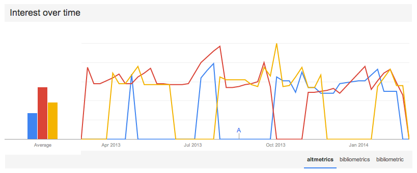

# altmetrics in Developing Regions: The promise, the perils, the future 

A significant group of scholars from around the world love to hate the Journal Impact Factor (JIF).[1] An incredible amount of ink has been spilled on describing its methodological limitations, its abuse and misuse, and its pervasive effects on "science." But, while the loathing of the JIF, I hazard to guess, is distributed fairly equally around the world, the scholars who are affected by its use are not. It is scholars from developing regions, especially those working in the social sciences and humanities, who suffer the most egregious consequences.

The problems for developing regions stem from the under-representation of developing world research in Thomson Reuters' Web of Science (WoS), from which the JIF is calculated. In a seminal piece from fifteen years ago, Cetto & Alonso-Gamboa ([1998](http://www.interciencia.org/v23_02/cetto.pdf)). layed out the disheartening situation of Latin American journals in international information systems such as the WoS. As can be seen from the figure below, which shows the relative number of works authored by scholars from around the world, this situation has not significantly changed over time. 

To be clear, it is not that developing regions simply produce less research. In Latin America, to draw on the region I am most familiar with, there were only 242 journals in WoS in 2012, out of over [5,000 peer-reviewed journals](http://www.latindex.org/index.html?opcion=2) published in Latin America (see [Latindex](http://www.latindex.org/)). Two initiatives, [SciELO](http://www.scielo.org) and [RedALyC](http://www.redalyc.org), working with only a subset of these journals, have also indexed hundreds of thousands of articles in regional journals, primarily from Latin American authors.[2] This is only to say, the research is there—locally produced and published in established venues. 

The argument for this bias in WoS has always been that developing world research does not form part of "mainstream" or "international" science, and although I take exception to this argument, it is irrelevant here. The end result, regardless of its rationale, is that the WoS is an inadequate dataset to understand the impact or otherwise study scholarly communications from developing regions. To serve scholars from developing regions, it is imperative to find an alternative.

	 
	See here, for an <a href="http://jalperin.github.io/d3-cartogram/">interactive map going back to 1990</a>.

## The alternative 

The scholarly community is abuzz with _[altmetrics](http://en.wikipedia.org/wiki/Altmetrics)_ and the related (but different) term _Article Level Metrics_.[3] These metrics, derived primarily from "the social Web," have been purposely constructed to be alternatives to the JIF. Since the drafting of the [altmetrics manifesto](http://altmetrics.org/manifesto/), there has been a [special issue](http://asis.org/Bulletin/Apr-13/), a [PLOS collection](http://www.ploscollections.org/altmetrics), a [Mendeley group](http://www.mendeley.com/groups/586171/altmetrics/), several [annual](http://lanyrd.com/2013/alm13/) [workshops](http://altmetrics.org/altmetrics14/), an increasing number of research papers, and several altmetric start-ups. During a few months in the last 12, the term _altmetrics_ has even been more popular than _bibliometrics_ and _bibliometric_ (although the term _Journal Impact Factor_ still dwarfs both). 

	 
	Or see what this looks like <a href="http://www.google.com/trends/explore?hl=en-US&q=altmetrics,+bibliometrics,+bibliometric&date=today+12-m&cmpt=q&content=1">today</a>

All of these signs indicate that altmetrics may not remain _alternative_ for long. Whether they supplant or complement the JIF, they bring with them a promise, but also some perils, for developing regions. 

## The promise

Altmetrics are captured from the Web (i.e., social media, blogs, wikipedia), and thus are (somewhat) more democratic. One reader, one vote.[4] Unlike citations, which are only counted if they come from a select group of journals, altmetrics are counted regardless of where they are originated, with one important consequences: they open the possibility of tracking impact in new segments, both within and beyond the academy. 

The corollary to this consequence is that scholars can be incentivized and rewarded for impact in these new segments. Given that the JIF was only useful for rewarding impact in WoS journals, and that developing world scholars were systematically under-represented here, this means that scholars would be able to focus on problems of local and regional interests (be they academic or public interests). Above all the potential benefits of altmetrics, this is the true promise for the developing world: an opportunity to redirect incentive structures towards problems that contribute to _development_, or at least to local priorities, be it through academic, policy, personal, or professional-practice impact. 

## The perils

This promise, however, is not by any means guaranteed to be fulfilled. I see two major pitfalls that would keep altmetrics from fulfulling this promise. First, the altmetrics community does not focus on further understanding the _ways_ in which altmetrics are different from citations. So far, much of the research has found that these new metrics capture a different “dimension”, “flavour”, or “type” of impact than citations ([Torres-Salinas et al., 2013](http://dx.doi.org/10.3916/C41-2013-05)); [Costas et al., 2014](http://arxiv.org/abs/1401.4321); [Haustein & Peters, 2013](10.1002/asi.23101); [Eysenbach, 2011](10.2196/jmir.2012)). There is reason to be optimistic—most altmetric research ends with a call for further study of the reliability, validity, and context of the available metrics. Without this understanding, however, altmetrics will only be used as a proxy for traditional citation impact. 

Second, if altmetrics become another end up primarily used as a way of ranking scholars. If this happens, then it will once again turn attention of developing world scholars to the communities in the United States and Europe—for this is where social media has most deeply penetrated. At the [ALM workshop](http://lanyrd.com/2013/alm13/) in October 2013, I presented a [series of maps](https://speakerdeck.com/jalperin/altmetrics-propagating-global-inequality) showing the levels of penetration of Internet, Twitter, Facebook, and Mendeley (common altmetric sources), and a new map from the Oxford Internet Institute shows the [uneven geography of Wikipedia](http://geography.oii.ox.ac.uk/#the-geographically-uneven-coverage-of-wikipedia). If the name of the game is to increase altmetric scores, it will still be a better strategy to cater to scholars in places where the sources of altmetrics are more heavily used (read: not in the developing world).

## The future

Further research on altmetrics in contexts beyond well-known and well-established journals (i.e., Science and Nature), and on research published in so-called “developed” countries (i.e., the United States or Western Europe) is desperately needed. However, this alone is not enough. The field and the tools of altmetrics must be crafted with the participation of a diverse group scholars so that their development can be inclusive of multiple perspectives and needs. 

In this direction, the [Public Knowledge Project](http://pkp.sfu.ca) (where I am a researcher) is now working with [PLOS' ALM application](https://github.com/articlemetrics/alm/wiki) to provide altmetrics to journals using the OJS platform (primarily in developing regions, see our [OJS Map](http://pkp.sfu.ca/ojs/ojs-usage/ojs-map/)). The idea is to bring altmetrics to developing regions _now_, not after scholars elsewhere have established the methods and norms of how altmetrics will be used. 

Clearly, much more could be done. The current focus on assessment (and to a lesser degree filtering and discovery) will give authors a new tool for demonstrating impact beyond citations, and it may help connect researchers with research. It is an important and necessary first step for the reasons I note above. If the first year of altmetrics/ALMs asked the "[_WHAT_ (are ALMs and should we care) to  _HOW_](http://blogs.plos.org/tech/alms/)", then a potentially beneficial next direction is to ask _WHO_ (is behind the metrics). _WHO_ would necesitate building tools that help scholars _identify_ and _connect_ with their audiences, creating a feedback loop that encourages authors to direct their research to areas of relevance to their primary audience, be it academic or public. Another is to again ask WHAT, but this time, WHAT (do we need metrics _of_). This would expand the offerings of altmetrics to non-traditional research products ([Piwowar, 2013](http://www.nature.com/nature/journal/v493/n7431/full/493159a.html)), including arbitrary URLs, since much of the work done by scholars in the developing world is not published in journals, or in journals with DOIs (which are currently required by most altmetric providers).

It is definitely early days, and the field is only now starting to consolidate. We are at first steps and early ideas, but I have high hopes for altmetrics, and faith in the altmetrics community to serve all scholars. Which directions altmetrics should go, how they should be used, or how the tools should be implemented is not for me to prescribe, but if we exclude (or do not seek to include) scholars from the developing world, altmetrics will become another tool from the North, for the North. And we already know that story. 

### Footnotes

[1] The [San Francisco Declaration on Research Assessment](http://am.ascb.org/dora/) (DORA), signed by over 10,000 individuals and 400 institutions, provides some of the background and justifications given by scholars for abandonning the JIF. Although it has been signed primarily by Europeans and North Americans, I believe it accurately captures the views of many scholars from around the world who are subjected to the tyranny of the JIF when being assessed. 
	
[2] Thomson Reuters recently announced a partnership with SciELO, whereby journals in SciELO will be indexed and appear in the Web of Knowledge. SciELO also calculates an Impact Factor based on its collection of over 1100 journals. However, even with SciELO, only a fraction of Latin America's research can receive an Impact Factor.

[3] Ian Mulvany, Head of technology for eLife, drew a [venn diagram](https://twitter.com/IanMulvany/status/424904870643384320) depicting the distinction.

[4] More precisely, it is: one reader, several potential votes.